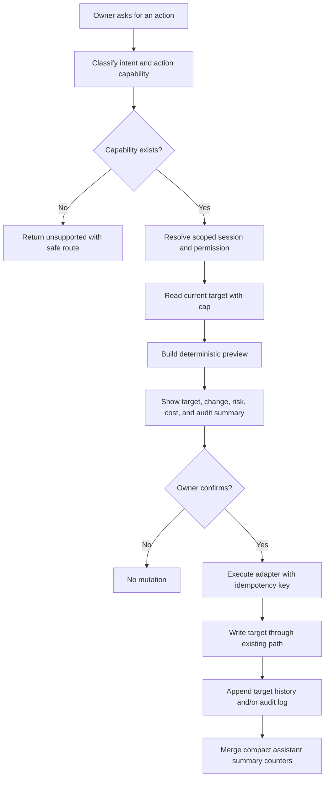

# Owner Support Assistant - Action Support Architecture

> **Status:** DEFERRED TARGET CONTRACT - no action runtime exists
> **Created:** 2026-06-07
> **Purpose:** Long-term owner-confirmed action contract for tickets, replies, unanswered-question review, and product-boundary-safe business actions.

---

## Final Decision

Owner Support Assistant may support actions, but only as typed adapters over actions the owner or staff member can already perform in the product.

The assistant is not allowed to become an unrestricted business action executor. Natural language can select and prepare an action, but execution requires:

- a known action capability
- an existing product-owned write path
- server-side tenant/store scope
- permission check
- validation
- preview
- explicit owner confirmation
- idempotency key
- target-record history and/or Answerlattice audit log

No generic `assistantActions`, `assistantJobs`, `assistantActionQueue`, or transcript-backed execution collection is added.

The supported case and prompt catalogue is defined in `owner-support-assistant_cases-and-actions.md`. This file owns execution mechanics; the cases file owns the user-facing capability list.

---

## Action Principles

| Principle | Contract |
| --- | --- |
| Existing manual action first | If a user cannot do the action in an existing governed workflow, the assistant must return `unsupported`. |
| Preview before write | The assistant returns the exact target, proposed change, risk, and audit summary before execution. |
| Confirmation required | A button/tap confirmation is required for every mutation. A text prompt alone is not execution consent. |
| LLM is not executor | LLM may draft text or explain a plan. Server action adapters perform validation and writes. |
| Product boundary | Answerlattice adapters write Answerlattice records only. MenuList actions require a MenuList-owned adapter and docs. |
| No new action store | Action state lives in the target record, existing audit logs, and compact summary counters. |
| Least reads | Preview uses the current context packet or one capped target read; execution performs only the target write path and audit write. |

---

## Repo Evidence Used

| Evidence | Current source |
| --- | --- |
| Answerlattice support routes already include Ticket Inbox, Conversations, Feedback, Support Board, and Governance with existing permissions | `src/constants/answerlattice/navigations.ts:185-193` |
| `MANAGE_SUPPORT`, `MANAGE_KNOWLEDGE`, `MANAGE_GOVERNANCE`, and related permissions already exist | `src/constants/answerlattice/permissions.ts:4-17` |
| Tickets already store status history and messages on the target ticket document | `src/types/supportTicket.ts:22-76` |
| Ticket reply writes already use `addTicketMessage()` with the existing message cap and notification path | `src/database/tickets/index.ts:224-280` |
| Ticket status writes already have an existing status update helper | `src/database/tickets/index.ts:285-334` |
| Ticket detail UI already emits resolution signals when a ticket becomes resolved or closed | `src/components/templates/platform/supportTickets/TicketDetailView.tsx:101-115` |
| Support Board already has bounded reads, cards, status history, notes, and no realtime listener | `src/database/answerlattice/supportBoard.ts:260-440` |
| Answerlattice audit logs already provide append-only tenant/store scoped governance history | `src/database/answerlattice/auditLogs.ts:1-45` |

---

## Action Families

| Action family | Assistant behavior | Durable write owner |
| --- | --- | --- |
| Navigation | Open the correct existing screen with context. | None. |
| Support Board work | Create card, update card, or add note through existing Support Board paths. | `answerlattice_supportBoardCards`. |
| Ticket status | Preview status change, then execute through the selected existing ticket status/update adapter. | Existing support ticket document plus audit log when executed by assistant. |
| Ticket reply | Draft reply text, show preview, then send through existing ticket message path after confirmation. | Existing support ticket document. |
| Unanswered-question review | Surface Support Board, signal, fallback, and repeated issue evidence; create review card or Knowledge Intake draft. | Support Board, Knowledge Intake, or mutation proposals. |
| Canonical answer update | Prepare review draft only; approval remains in Governance. | `answerlattice_mutationProposals` / Governance. |
| FAQ/KB/surface draft | Prepare source-backed review output through Knowledge Intake only. | Knowledge Intake sources and review items. |
| Cross-product business action | Return `unsupported` unless a product-specific adapter exists for that product boundary. | Target product system, not Answerlattice assistant storage. |

---

## Capability Registry

Every executable action needs a registry entry. The registry is code, not Firestore data.

```ts
type OwnerSupportAssistantActionMode = 'preview' | 'execute';

type OwnerSupportAssistantActionRisk = 'low' | 'medium' | 'high';

type OwnerSupportAssistantActionCapability = {
  key: string;
  productId: 'AL' | 'MENULIST';
  targetType: 'support_ticket' | 'support_board_card' | 'mutation_proposal' | 'knowledge_intake_source' | 'route' | 'external_product';
  requiredPermission: string;
  supportedModes: OwnerSupportAssistantActionMode[];
  confirmationRequired: true;
  idempotencyRequired: true;
  risk: OwnerSupportAssistantActionRisk;
  readCap: number;
  writeOwner: 'target_record' | 'audit_log' | 'none';
};
```

The first Answerlattice registry entries should be:

| Capability key | Required permission | Execution path |
| --- | --- | --- |
| `open_review_route` | Matching route permission | No write. |
| `create_support_board_card` | `canManageSupport` | Existing Support Board DAL/API. |
| `add_support_board_note` | `canManageSupport` | Existing Support Board DAL/API. |
| `update_ticket_status` | `canManageSupport` | Existing ticket status/update adapter. |
| `draft_ticket_reply` | `canManageSupport` | Preview only until owner confirms send. |
| `send_ticket_reply` | `canManageSupport` | Existing `addTicketMessage()` adapter after confirmation. |
| `create_repeated_reply_source` | `canManageKnowledge` | Existing Knowledge Intake `repeated_reply` path. |
| `create_canonical_proposal` | `canManageGovernance` | Existing mutation proposal path. |

---

## Preview And Execute Flow



Preview must not write. Execution must not call raw Firestore directly when an existing DAL/API route owns the target mutation.

---

## Action API Contract

Add action endpoints only when implementation needs server-owned mutation control. Client-only direct DAL writes should not be used for assistant execution if the action needs permission, audit, idempotency, or AI-drafted payload validation.

| Endpoint | Method | Purpose | Storage behavior |
| --- | --- | --- | --- |
| `/api/answerlattice/support-assistant/actions/preview` | `POST` | Return deterministic action preview. | Reads current target only; no write. |
| `/api/answerlattice/support-assistant/actions/execute` | `POST` | Execute a previously previewed action after confirmation. | Existing target write path plus audit/summary metadata. |

Preview request:

```ts
{
  capability: string;
  target: {
    type: string;
    id?: string;
  };
  input: Record<string, unknown>;
  answerId?: string;
  contextHash: string;
}
```

Execute request:

```ts
{
  previewId: string;
  capability: string;
  target: {
    type: string;
    id?: string;
  };
  confirmed: true;
  idempotencyKey: string;
}
```

The server must rebuild or verify the preview before execution. The client preview is not trusted.

---

## Storage Ownership

| Action data | Store here | Do not store here |
| --- | --- | --- |
| Preview text | Response only | Preview collection. |
| Confirmation state | Request only | Assistant action session. |
| Idempotency key | Target record metadata or audit log metadata when needed | Generic action queue. |
| Executed ticket status | Existing ticket status/history fields | Assistant action document. |
| Executed ticket reply | Existing ticket messages array | Assistant message collection. |
| Support plan | Support Board card/note | Assistant plan collection. |
| Action audit | Existing target history and `answerlattice_auditLogs` when assistant execution needs explicit audit | Assistant audit collection. |
| Action metrics | `platformSummary/ownerSupportAssistantSummary_{tId}_{sId}` counters | Assistant events collection. |

---

## Ticket Status Contract

Ticket status changes are allowed only through a ticket action adapter.

The adapter must:

1. Require `canManageSupport`.
2. Read the target ticket by scoped tenant/store.
3. Validate target status against `SUPPORT_TICKET_STATUS`.
4. Reject no-op or invalid transitions.
5. Preview the status, customer notification implication, and resolution-signal implication.
6. Execute through the canonical ticket update helper chosen during implementation.
7. Preserve status history and system message behavior.
8. Preserve existing ticket-resolution signal behavior for resolved/closed transitions.
9. Write an Answerlattice audit log entry when assistant execution needs searchable governance history.

The implementation must choose one canonical path for assistant status writes. It must not mix direct `updateTicket()` calls and `updateTicketStatus()` calls in a way that loses status history, system messages, or ticket-resolution signals.

---

## Ticket Reply Contract

Ticket replies can be supported as owner-confirmed actions.

The assistant may:

- summarize the ticket context from bounded current-ticket data
- draft reply text from scoped context
- show the exact reply before send
- allow the owner to edit the draft
- send only after explicit confirmation

The assistant must:

- use the existing ticket message write path
- respect the existing ticket message cap
- preserve the existing notification path
- avoid sending full raw ticket history to an LLM
- refuse reply generation when the target ticket or customer contact context is missing
- log assistant involvement through target metadata or audit log without storing a duplicate conversation

If reply sending is not safely available in the active runtime, the assistant should return a draft and open the ticket screen instead of claiming the reply was sent.

---

## Unanswered-Question Review Contract

Unanswered questions are not a separate assistant queue.

The assistant should reuse:

- Support Board `NEEDS_ANSWER` cards
- ticket and escalation signals
- friction summaries
- coverage and trust summaries
- Knowledge Intake repeated-reply path
- mutation proposals

Allowed actions:

- open Support Board filtered to review-needed items
- create a Support Board card from evidence
- add a Support Board note
- create a `repeated_reply` source when the owner provides a reusable Q/A pair
- prepare a canonical answer proposal when an entity and evidence are present

Blocked actions:

- inventing an answer without source evidence
- marking an unanswered item resolved without target workflow update
- creating a raw assistant queue item
- generating a KB article when the owner only asked for a short repeated Q/A draft

---

## MenuList And Cross-Product Boundary

The same action architecture can support product actions beyond Answerlattice, but each product must own its adapters.

Answerlattice Owner Support Assistant must not directly mutate MenuList stores, menus, dashboard analytics, billing, public menu output, owner notifications, or customer-facing records. If a MenuList owner action is needed, it must be implemented as a MenuList-scoped action adapter using MenuList docs, rules, DAL/API paths, cache invalidation, permissions, and Firebase project rules.

Cross-product requests from the Answerlattice assistant return `unsupported` unless a signed product bridge exists with:

- explicit product id
- explicit target tenant/store
- product-owned permission check
- product-owned validation
- product-owned write path
- product-owned audit/cache invalidation contract

This keeps Answerlattice from becoming a cross-product mutation layer.

---

## Firebase Cost Contract

| Operation | Cost ceiling |
| --- | --- |
| Action preview | Existing context packet or one target read; no write. |
| Unsupported action | Validation and classification only; no detail scan. |
| Ticket status execution | One target ticket write through existing path plus audit/summary metadata when required. |
| Ticket reply execution | Existing ticket message write plus existing notification side effect. |
| Support Board action | Existing Support Board write or transaction. |
| Knowledge/Governance draft | Existing Knowledge Intake or mutation proposal writes. |
| Action metrics | Merge aggregate counters only; no event document per action. |

No realtime listener, generic action queue, action event stream, action transcript, or per-action scheduled worker is allowed.

---

## Security Contract

- Resolve `tId`, `sId`, user id, and permission server-side.
- Use Zod schemas for every action input.
- Apply rate limits before LLM drafting and before mutation execution.
- Use idempotency for execute endpoints so duplicate taps do not duplicate replies or status changes.
- Keep high-risk actions behind stronger preview text and confirmation.
- Never show secrets, widget keys, payment data, auth/session tokens, or unrestricted customer payloads.
- Keep all customer-facing text reviewable before sending.
- Return generic failure messages and secure logs.

---

## Rejected Designs

| Design | Verdict |
| --- | --- |
| Generic assistant action queue | Reject; adds cost, duplicate state, and ambiguous ownership. |
| One assistant action collection per product | Reject; target records and product audit logs already own outcomes. |
| Direct natural-language execution | Reject; confirmation is mandatory. |
| LLM-selected write path | Reject; typed server adapters own execution. |
| Cross-product mutation from Answerlattice | Reject unless a product-owned bridge is explicitly designed. |
| Assistant-owned unanswered-question queue | Reject; Support Board and Knowledge Intake already own review work. |

---

## Version History

| Date | Change |
| --- | --- |
| 2026-06-07 | Added long-term action-support architecture for owner-confirmed ticket, reply, unanswered-question, and product-boundary-safe actions without a new action collection. |
