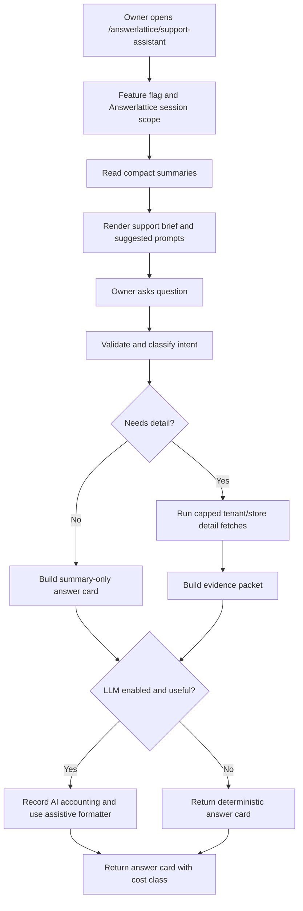
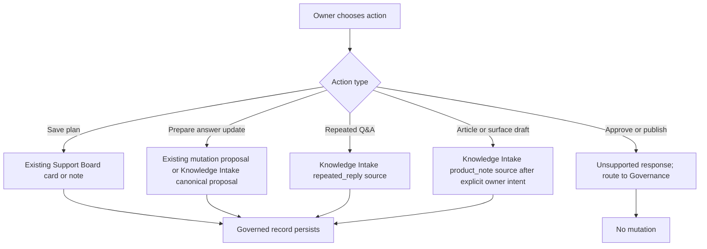

# Owner Support Assistant - Architecture Alignment

> **Status:** PLANNED
> **Created:** 2026-06-07
> **Purpose:** End-to-end storage, function, API, reuse, and ChatGPT alignment contract before runtime implementation.

---

## Architecture Verdict

Owner Support Assistant should be built as a cost-bounded owner review layer over existing Answerlattice infrastructure.

It must not become a separate assistant product with its own transcript store, session store, plan store, feedback store, attribution store, analytics warehouse, or scheduler. Durable work must land in existing governed systems. The assistant may add a compact `platformSummary` read model for aggregate counters, because the repo already uses `platformSummary` for low-read Answerlattice owner surfaces.

Final strategy:

1. Use existing summary docs for initial brief.
2. Use deterministic intent classification before detail reads.
3. Use bounded tenant/store-scoped detail fetches only after explicit owner query.
4. Use existing Support Board, Governance, Knowledge Intake, FAQ, KB, and mutation proposal paths for writes.
5. Use AI only as an assistive wording layer after deterministic context is assembled.
6. Use one compact `platformSummary/ownerSupportAssistantSummary_{tId}_{sId}` document for aggregate assistant counters.
7. Add no assistant-owned Firestore collection.
8. Add no standalone scheduled Cloud Function.

---

## Doctrine Fit

| Doctrine point | Architecture decision |
| --- | --- |
| Governed Answer Infrastructure | The assistant reviews governed signals and routes owners to existing governed workflows. |
| Canonical answers first | Canonical answer and mutation proposal flows remain authoritative. |
| Human approval | The assistant can prepare a draft, but approval and publishing stay in Governance. |
| Not a chatbot/helpdesk | UI is structured answer cards, not open-ended social chat or ticket operations. |
| Infrastructure freeze | No new high-volume data system, no separate scheduler, no long-tail workflow surface. |
| Firebase cost priority | Summary-first reads, capped detail reads, hash-skipped summary writes, no realtime listener. |

---

## Repo Evidence Used

| Evidence | Current source |
| --- | --- |
| Answerlattice has product-local collection constants and no assistant collection | `src/constants/answerlattice/database.ts:9-40` |
| Support Board already has bounded list reads and one-read summary | `src/database/answerlattice/supportBoard.ts:260-303` |
| Support Board already supports card creation, status history, and notes | `src/database/answerlattice/supportBoard.ts:305-440` |
| Repeated reply intake creates FAQ and canonical proposal drafts only | `src/lib/answerlattice/knowledgeIntake.ts:1262-1298` |
| Generic intake source creates KB article plus FAQ/canonical proposals | `src/lib/answerlattice/knowledgeIntake.ts:1300-1355` |
| AI operations already write Answerlattice logs under `answerlattice_aiOperations/{tId}/{sId}` | `src/lib/ai/operationLog.ts:103-132` |
| Nightly scheduler already runs many tenant tasks through one master flow | `functions-answerlattice/src/answerlattice/answerlatticeNightly.ts:1934-2187` |
| Knowledge Intake summary writes compact `platformSummary` docs only when changed | `functions-answerlattice/src/answerlattice/knowledgeIntakeSummary.ts:43-132` |

---

## Data Ownership Map

| Feature need | Store here | Do not store here | Reason |
| --- | --- | --- | --- |
| Initial assistant brief | Existing compact summaries plus `platformSummary/ownerSupportAssistantSummary_{tId}_{sId}` | New `assistantBriefs` collection | Keeps first load to summary reads. |
| Owner question text | Request memory only; redacted AI operation metadata only when LLM runs | Transcript/session/message collection | Avoids privacy, retention, and read growth. |
| Evidence references | Response payload and nullable assistant metadata on governed records | Attribution collection | Source records are already queryable and governed. |
| Saved plan | `answerlattice_supportBoardCards` or card notes | `assistantPlans` collection | Support Board is the existing owner work tracker. |
| Canonical answer update | `answerlattice_mutationProposals` or Knowledge Intake canonical proposal path | Assistant-owned draft collection | Governance stays the approval path. |
| Repeated Q&A draft | Knowledge Intake `repeated_reply` source | Generic intake source | `repeated_reply` creates FAQ and canonical proposal drafts without unwanted article drafts. |
| KB article or product surface draft | Knowledge Intake `product_note` source only after explicit owner intent | Implicit assistant source | Generic intake can create article/surface output, so it requires explicit owner intent. |
| Feedback on assistant answer | Aggregate counters in `platformSummary/ownerSupportAssistantSummary_{tId}_{sId}` and operation metadata when an LLM operation exists | `assistantFeedback` collection | Enough to measure quality without storing raw conversations. |
| LLM cost/audit | `answerlattice_aiOperations/{tId}/{sId}` | Separate assistant operation collection | Existing AI accounting is already product-aware. |

---

## Planned Compact Summary

Document:

```text
platformSummary/ownerSupportAssistantSummary_{tId}_{sId}
```

Shape:

```ts
{
  schemaVersion: 1,
  pId: 'AL',
  tId: number,
  sId: number,
  lastUpdated: Timestamp,
  summarySource: 'answerlattice_nightly' | 'support_assistant_feedback',
  summaryHash: string,
  lastAskedAt: Timestamp | null,
  lastAssistantOperationId: string | null,
  totalQuestions: number,
  summaryOnlyQuestions: number,
  boundedDetailQuestions: number,
  aiAssistedQuestions: number,
  unsupportedQuestions: number,
  savedPlans: number,
  preparedDrafts: number,
  positiveFeedback: number,
  negativeFeedback: number,
  lastUnsupportedReason: string | null,
  topIntents: Array<{ intent: string; count: number }>,
}
```

Constraints:

- No raw prompt.
- No raw answer.
- No message list.
- No source text body.
- No secret, key, token, or customer payload.
- Hash-skip scheduled writes.
- Direct feedback writes merge counters only.

---

## API Contract

| Endpoint | Method | Purpose | Storage behavior |
| --- | --- | --- | --- |
| `/api/answerlattice/support-assistant/brief` | `GET` | Return summary packet for initial route load. | Reads summaries only, no writes. |
| `/api/answerlattice/support-assistant/query` | `POST` | Validate question, classify intent, build context, return answer card. | Writes only if LLM accounting is triggered. |
| `/api/answerlattice/support-assistant/feedback` | `POST` | Record aggregate answer usefulness. | Merges summary counters and AI operation metadata when an operation exists. |

No separate save-plan API is required unless implementation proves existing Support Board DAL/API cannot enforce permission or metadata needs cleanly. Saved plans should use Support Board paths.

Suggested prompts can be derived from the brief response. A separate suggestions endpoint is not required for the frozen architecture.

---

## Read Flow



---

## Write Flow



---

## Cloud Function Logic

Do not create a new scheduled Cloud Function.

If aggregate assistant summary needs scheduled refresh, add a helper such as:

```text
functions-answerlattice/src/answerlattice/ownerSupportAssistantSummary.ts
```

Then call it from the existing Answerlattice nightly flow under the existing master scheduler. The helper must follow the current summary patterns:

- Discover tenants through the existing scheduler tenant registry.
- Query only bounded recent AI operations and governed records.
- Write `platformSummary/ownerSupportAssistantSummary_{tId}_{sId}`.
- Skip writes when `summaryHash` is unchanged.
- Record task details in existing scheduler run logs.
- Use an `ENABLE_ANSWERLATTICE_OWNER_SUPPORT_ASSISTANT` or related server flag if scheduled summary work is added.

This matches the existing `knowledgeIntakeSummary` and Support Board summary model instead of creating assistant-specific infrastructure.

---

## Action Routing Decisions

| ChatGPT idea | Final decision |
| --- | --- |
| Save plans | Accept, but store as Support Board cards or notes. |
| Feedback on answers | Accept, but aggregate only; no feedback collection. |
| Prompt chips | Accept, derive from brief/context without extra endpoint until implementation proves a need. |
| Contextual cards | Accept behind flag/permissions using the same brief packet. |
| Global drawer | Reject as always-on default; too much noise and read pressure. Dedicated route is canonical. |
| Dedicated assistant sessions | Reject; no transcript/session collection. |
| Assistant attributions collection | Reject; evidence references stay in response and governed record metadata. |
| Analytics event stream | Reject; use aggregate counters, governed artifacts, and AI operation logs. |
| LLM after deterministic backend | Accept; LLM is assistive formatter only. |
| Canonica route/constants | Reject; all names use Answerlattice namespace and `pId: AL`. |

---

## Existing-System Modifications

These are additive implementation changes, not new product subsystems:

| Area | Additive change |
| --- | --- |
| Feature flag | Add `ENABLE_ANSWERLATTICE_OWNER_SUPPORT_ASSISTANT`, default `false`. |
| Navigation | Add Support Assistant route/nav item inside Answerlattice Support Control when flag allows. |
| Support Board type | Add `assistant` as an allowed source type if saved plans need source attribution. |
| Support Board card metadata | Add nullable `assistantContext` with `intent`, `contextHash`, `evidenceRefs`, and `answerId`. |
| Mutation proposal metadata | Add nullable assistant context when drafts are prepared from assistant evidence. |
| AI actions | Add a dedicated Answerlattice owner assistant AI action only if accounting needs a separate unit. |
| Firestore rules | Extend existing collection/doc access only for changed fields and new summary doc. |
| Firestore indexes | Add only if implementation introduces a real query on new assistant metadata. |

---

## Firebase Cost Contract

| Operation | Cost ceiling |
| --- | --- |
| Initial route load | Summary docs only; no list scans, no listener, no AI call, no write. |
| Summary-only query | Reuse in-memory route packet when possible; no AI by default. |
| Bounded detail query | Capped tenant/store queries by intent; no broad collection scan. |
| Unsupported request | Validation/classification only; no detail fetch, no AI call, no write except aggregate counter when feedback is submitted. |
| Saved plan | Existing Support Board write path only. |
| Draft proposal | Existing mutation proposal or Knowledge Intake write path only. |
| Feedback | One bounded aggregate merge and operation metadata update when an LLM operation exists. |
| Scheduled summary | Existing nightly scheduler only; hash-skip writes. |

---

## Security Contract

- Resolve `tId` and `sId` from scoped Answerlattice session, never from trusted client input.
- Apply `withAuth`, Answerlattice management permission checks, Zod validation, and rate limits before expensive work.
- Redact prompt-like text before logs and AI metadata.
- Do not send secrets, widget keys, raw unrestricted tickets, billing records, or team-role data to LLM context.
- Refuse unsupported mutation requests with a safe review route.
- Preserve `pId: 'AL'` on every Answerlattice-owned record or summary.

---

## Long-Term Decision Lock

This doc set is not a maturity-step plan. The implementation should build the complete architecture behind flags and permissions. Build order can still protect engineering safety, but it must not create a partial product contract, public promise, or separate assistant data model.

If runtime implementation discovers a need for any assistant-owned collection, new scheduler, raw transcript retention, or direct publishing flow, that is an architecture change. It needs a new doctrine, security, Firebase cost, and product-boundary review before code is written.

---

## Version History

| Date | Change |
| --- | --- |
| 2026-06-07 | Added end-to-end architecture alignment after cross-checking the ChatGPT conversation against Answerlattice doctrine, existing data systems, Firebase cost, and Cloud Function patterns. |
