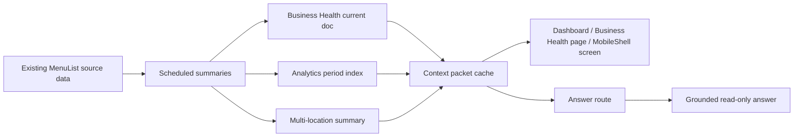
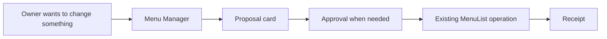

# Owner Business Assistant Architecture

**Owner-Facing Name:** Business Health
**Status:** Current read-only architecture
**Last Updated:** June 29, 2026

## Architecture Summary

Business Health is a bounded read model and answer layer over existing MenuList data. It is not an action layer and does not own public-truth writes.

Owner actions are intentionally outside this graph:

## Data Ownership

Business Health may read from:

- scheduler-built platform summary docs
- owner dashboard analytics summaries
- bounded Business Health current docs
- bounded analytics index docs
- bounded multi-location summary docs
- optional compact thread docs
- internal answer event docs for monitoring

Business Health must not own:

- menu/project truth
- store truth
- outlet truth
- staff truth
- billing truth
- public publish state
- generated media assets
- external platform state
- action proposals, action drafts, or action audit records

## Runtime Pieces

| Layer | Current Role |
| --- | --- |
| Scheduler | Builds compact current health, snapshots, analytics index, and multi-location summary. |
| Context packet builder | Combines bounded read-model facts into an answer/dashboard packet. |
| Context packet cache | Keeps server packets keyed by tenant, store, project context, and packet profile. |
| API routes | Serve current health, analytics, locations, answers, threads, feedback, and platform monitor data. |
| Desktop UI | Shows dashboard card, analytics strip, full Business Health route, questions, answers, and checks. |
| Mobile UI | Shows read-only Business Health inside `MobileShell`. |
| Platform monitor | Reviews answer quality, unsupported gaps, feedback, source coverage, and cost. |

Removed action pieces:

- action API route
- action registry/executor
- action schemas/types
- action hook
- desktop action sheet
- mobile action sheet
- action/draft collections

## API Boundary

Business Health APIs are protected and read-oriented:

- `/api/owner-business-assistant/current`
- `/api/owner-business-assistant/analytics`
- `/api/owner-business-assistant/answer`
- `/api/owner-business-assistant/locations`
- `/api/owner-business-assistant/sessions/[sessionId]`
- `/api/platform/owner-business-assistant/monitor`

There is no active Business Health operation execution route.

All APIs must keep:

- auth/session guard
- tenant/store/project scope validation
- Zod or equivalent runtime validation
- bounded payloads, including a 32KB `/answer` request body cap before answer resolution
- bounded browser request/response handling: current, analytics, locations, thread, answer, and platform monitor callers use same-origin credentials, no browser cache, manual redirect handling, and the appropriate bounded response reader before UI or SWR state updates
- bounded guard security metadata: selected-store, tenant-access, and rate-limit security events record route/session/request presence-length metadata instead of raw IDs, emails, IPs, or user-agent strings
- generic owner-safe errors
- rate limits before provider-backed answer calls
- no raw sensitive prompt, staff/customer/payment, secret, or stack-trace logging

## Packet Profiles

Active packet profiles:

- `health_card`
- `analytics_periods`
- `owner_question_basic`
- `multi_location_summary`

No packet profile includes an operation catalog. Cached packets do not carry operation kill-switch state because operations are no longer part of Business Health.

## Firestore Cost Shape

Business Health follows the compact-doc model:

- no Firestore write per token
- no document per streamed word
- no document per card render
- bounded thread messages
- bounded answer events
- bounded platform monitor queries
- no generated media/base64 payloads
- no action/draft workflow collections

## Mobile Architecture

Mobile Business Health is a `MobileShell` sub-screen. It must not route to desktop as the primary path, and it must not open action sheets. Owner operations from mobile belong to Menu Manager inside the mobile shell.

## Public Truth and Cache Boundary

Business Health does not write public truth. Existing project/store/outlet/publish flows remain responsible for public cache invalidation. Menu Manager must use existing MenuList mutation paths when it performs approved work.

Public Truth readiness inside Business Health is read-only. The current owner card computes eight modules from existing store/project data: public truth basics, QR link health, menu/service clarity, WhatsApp action link, hours, photo/visual identity, Google profile handoff, and menu freshness. Google profile handoff uses owner-confirmed MenuList state and live customer-link readiness only; it does not scan Google or update external profiles. Menu freshness uses selected/default MenuList menu timestamps only; it does not crawl external menus.

## Business Health and Menu Manager

Business Health may surface an observation such as "3 popular items are missing photos." It must not generate or apply photos. Menu Manager may later consume that observation through its own registered adapter and proposal-card flow.
